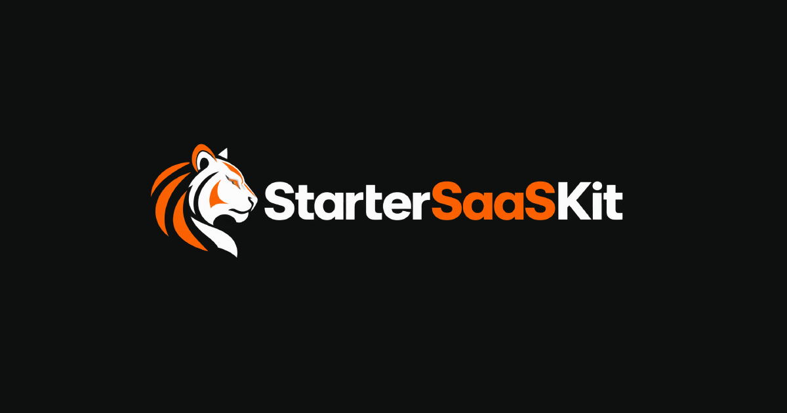

<p align="center">
  
</p>

<h3 align="center">Answer a few questions. Download a repo. Its test suite is already green.</h3>

<p align="center">
  Framework, components, database, ORM, auth, billing, email — pick your stack,
  and every combination is generated, wired together, and proven to pass
  before it is offered.
</p>

<p align="center">
  <a href="https://github.com/Aymenjdily/startersaaskit/actions/workflows/ci.yml"></a>
  
  
  
</p>

<p align="center">
  <a href="#getting-started">Getting started</a> ·
  <a href="#stack">Stack</a> ·
  <a href="#project-layout">Project layout</a> ·
  <a href="#deployment">Deployment</a>
</p>

---

## What this is

StarterSaaSKit is a SaaS product, not a boilerplate you fork. Sign in, answer
a short set of questions about the stack you want, and it generates a
repository around your choices — then delivers it as a zip, ready to unpack
and push wherever you like.

**This repository is the product itself**: the marketing site, the console,
and the generator that assembles the repos it hands out. It is built on
TanStack Start, which is an implementation detail of *this* app — the
generator can hand you Next.js, TanStack Start, or React + Vite for *yours*.

Every question narrows the next one, so you can never assemble a combination
that does not fit together — a pairing that cannot work is never offered in
the first place. Every combination the wizard can produce is generated and
checked in CI (`starter-matrix.test.ts`) before it ships, so "green on the
first run" is a tested claim, not a slogan.

## Stack

| | |
|---|---|
| **Framework** | TanStack Start + TanStack Router + TanStack Query (React 19) |
| **Styling** | Tailwind CSS 4, shadcn-style components |
| **Auth & database** | Supabase (email/password + Google OAuth, Postgres with RLS) |
| **Tests** | Vitest + Testing Library |
| **Lint/format** | Biome |
| **Zips** | fflate |

## Getting started

Requires Node 20+ and pnpm.

```bash
pnpm install
cp .env.example .env.local
# fill in VITE_SUPABASE_URL and VITE_SUPABASE_ANON_KEY
pnpm dev
```

### Supabase setup

1. Create a project at [supabase.com](https://supabase.com).
2. Copy the project URL and anon key (Project Settings → API) into
   `.env.local`. Only the **anon/publishable** key goes behind a `VITE_`
   prefix — never the service-role key.
3. Apply the migrations in order:

   ```bash
   supabase db push   # or run each file by hand, in order:
   # supabase/migrations/0001_profiles.sql
   # supabase/migrations/0002_starters.sql
   # supabase/migrations/0003_feedback.sql
   # supabase/migrations/0004_generation_quota.sql
   # supabase/migrations/0005_create_starter_ambiguity.sql
   # supabase/migrations/0006_feedback_reward.sql
   # supabase/migrations/0007_product_feedback.sql
   # supabase/migrations/0008_delete_own_account.sql
   ```

   `0008` adds `delete_own_account()`, the function Settings' danger zone
   calls. Without it the delete button fails outright rather than deleting
   the wrong thing — the function does not exist yet, so there is nothing to
   call by accident.

   `0007` adds the `product_feedback` table and repoints the reward at it, so
   the ten generations are paid for the feedback the button asks for rather
   than for filing a bug.

   `0006` moves the allowance onto the account so feedback can raise it, and
   narrows the column privileges on `profiles` — before it, the owner policy
   from `0001` let any browser reset its own `generations_used`.

   `0004` is not optional. Creating a starter goes through `create_starter()`,
   which that migration defines — without it every generation fails with
   "Built it, but could not save the record", because the same migration
   drops the direct insert policy that would otherwise let the quota be
   bypassed.

4. *(Optional)* Seed an admin account for the feedback board:

   ```bash
   # edit the email in supabase/seed-admin.sql first, then paste it into the
   # Supabase SQL editor — or, with a direct connection string to *this*
   # project (Project Settings → Database), not whatever DATABASE_URL happens
   # to hold:
   psql "<supabase-connection-string>" -f supabase/seed-admin.sql
   ```

5. Allow every host you actually use back in: Authentication → URL
   Configuration → **Redirect URLs**. Both `signInWithOAuth` and `signUp`
   build their `redirectTo` from `window.location.origin` at request time
   (`src/components/auth/controls.tsx`), so Supabase is asked to send the
   reader back to whichever host they started on — but it only honours that
   if the host is on this list. Add both:

   ```
   http://localhost:3000/auth/callback
   https://<your-deployed-domain>/auth/callback
   ```

   Anything not on the list is silently redirected to the **Site URL** above
   it instead, which is why a sign-in started on `localhost` while that field
   still holds the production domain lands you back in production —
   `strictPort` in `pnpm dev` (`package.json`) exists so `:3000` is always
   the port you are actually testing on, and never silently becomes `:3001`
   behind this list's back.

6. *(Optional)* Enable Google OAuth: add the provider in Supabase Auth →
   Providers. Its "Authorized redirect URI" is **Supabase's own** callback
   (shown on that screen, shaped like
   `https://<project-ref>.supabase.co/auth/v1/callback`) — not this app's
   `/auth/callback`, which is already covered by step 5 and does not change
   per provider.

## Scripts

| Command | What it does |
|---|---|
| `pnpm dev` | Dev server on `:3000` |
| `pnpm build` | Production build |
| `pnpm test` | Full test suite |
| `pnpm test:coverage` | Coverage report |
| `pnpm check` | Biome lint + format check |
| `pnpm generate-routes` | Regenerate `src/routeTree.gen.ts` after adding routes |

## Project layout

```
src/
├─ routes/           file-based routes — index (landing), auth, console,
│                     api/generate, robots.txt, sitemap.xml
├─ components/        landing/, console/, auth/, starters/, ui/
├─ lib/generate/       the starter generator
│  ├─ build-starter.ts   assembles the repo
│  ├─ fragments.ts       per-stack file templates
│  └─ zip.ts              packs the download
├─ lib/seo.ts         every page's metadata in one place — SITE_URL is
│                     the deployed domain
└─ lib/brand.ts       product name, logo, and repo URL in one place

supabase/migrations/  schema, applied in numeric order; all access is
                       enforced by row-level security
context/               product and design docs
```

## Deployment

Any host that runs a TanStack Start production build (`pnpm build`). Set the
`VITE_SUPABASE_*` env vars, and keep `SITE_URL` in `src/lib/seo.ts` matching
the deployed domain — canonical URLs, Open Graph cards, `robots.txt`, and the
sitemap are all built from it.

## Contributing

Issues and pull requests are welcome. Before opening a PR, run:

```bash
pnpm check && npx tsc --noEmit && pnpm test
```

CI runs the same three checks, plus a production build, on every push.
